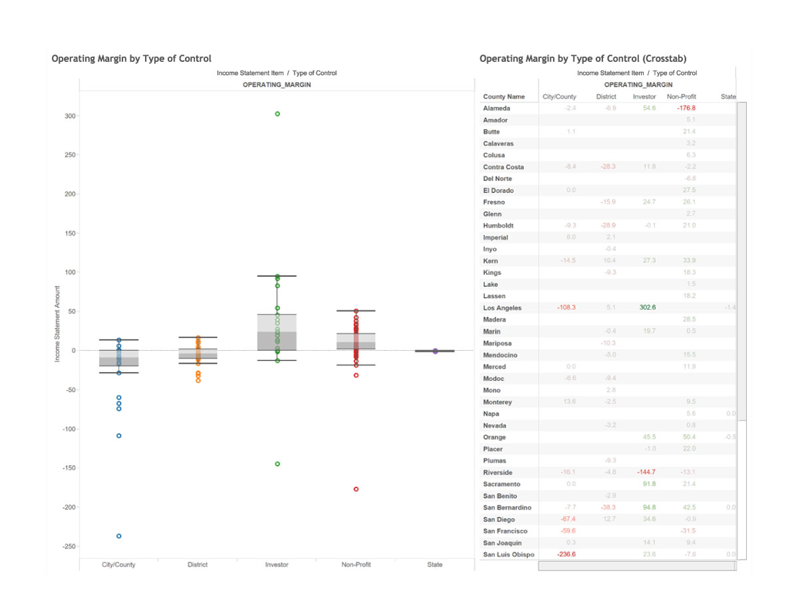
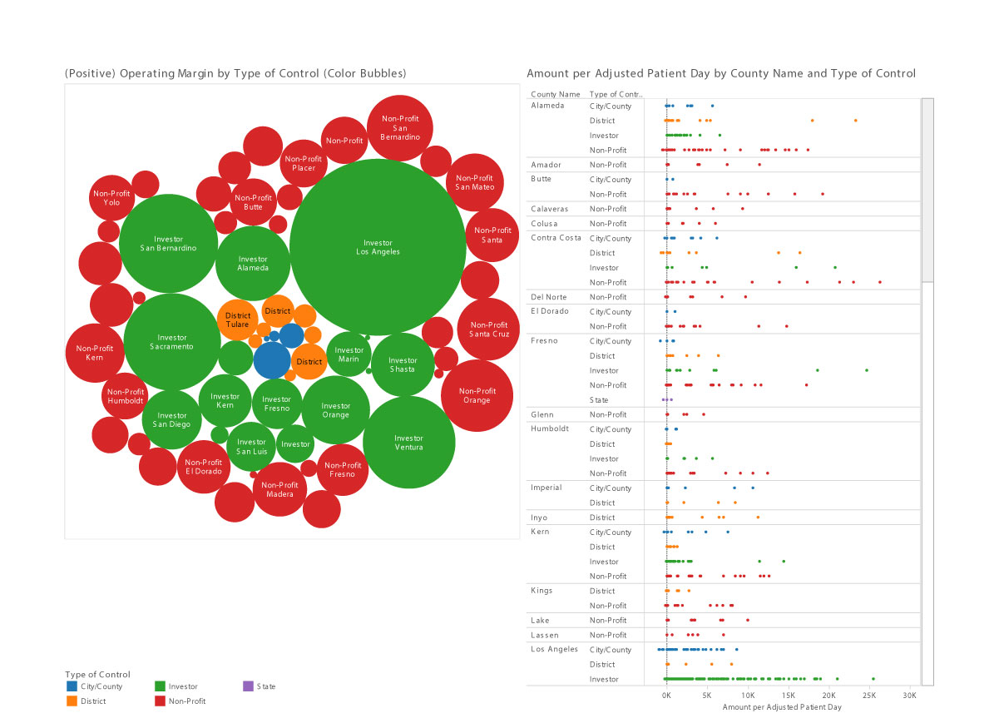
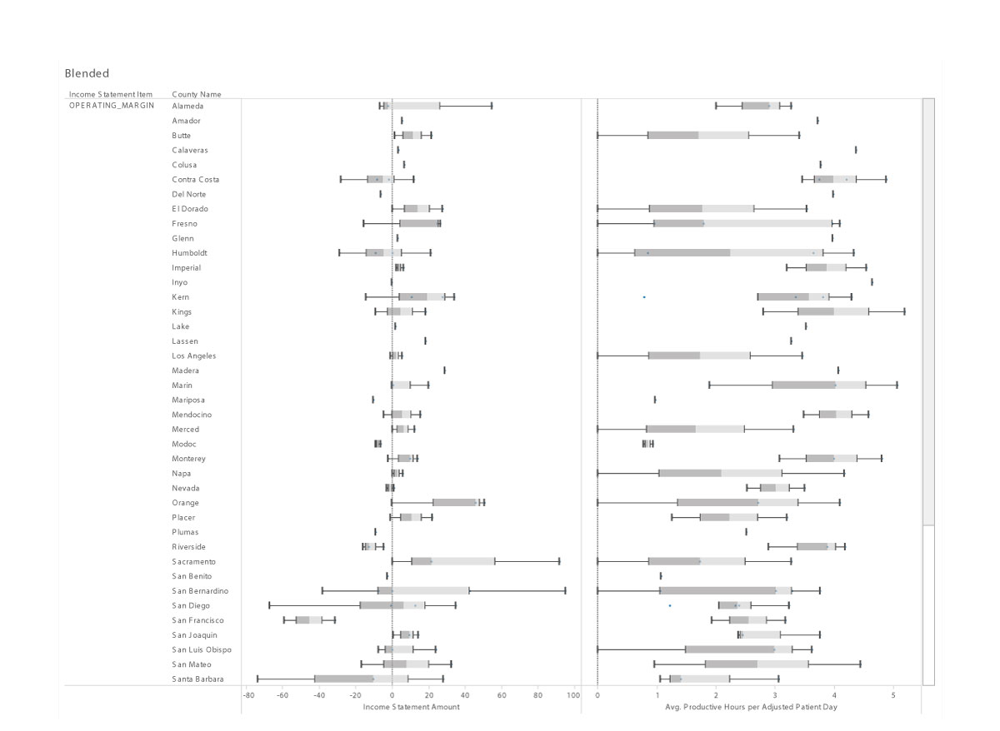

## Pollution, Death, Hospitals...
# The Final Project!

1) We used various data sets from California and New York centering around Health, Healthcare, and Environmentmental measures.

2) We created Extract, Transform, and Load files in R for necessary datas set to prepare the data to be uploaded to the Oracle SQL database to be accessed later in Tableau workbooks and Shiny modules.

```{r}
source("C:/Users/jasta/OneDrive/Documents/Class/Fall 2015/DataVisualizations/DV_FinalProject/01 Data/Leading_Cause_Of_Death_ETL.R", echo = TRUE)
```

```{r}
source("Zipcode_file_ETL.R", echo = TRUE)
```

```{r}
source("Hospital_Profitability_ETL.R", echo = TRUE)
```

3) We created a ui.R file and server.R file to launch the Shiny app.

```{r}
source("../04 Shiny/ui.R", echo = TRUE)
```

```{r}
source("../04 Shiny/server.R", echo = TRUE)
```

4) We used Tableau to create the following graphs and data visualizations on our topics.

  
  
  

5) We deployed the finished shiny app(s) onto the shinyapp.io server after recreating or drawing inspiration from some of the more interesting Tableau graphs and outputs:

URL: https://addison.shinyapps.io/Health