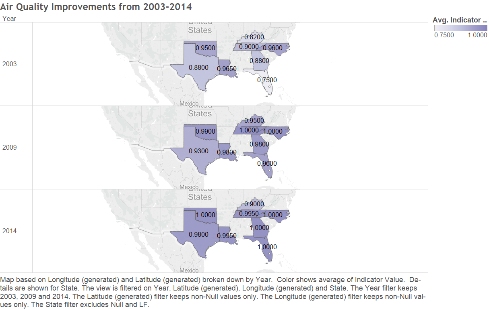
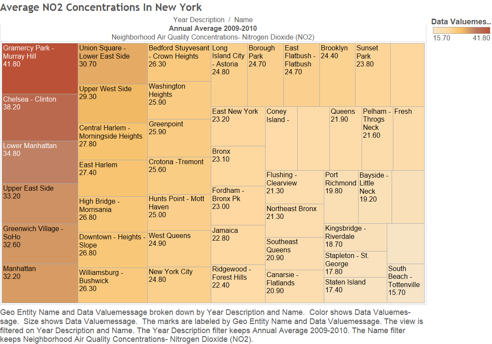
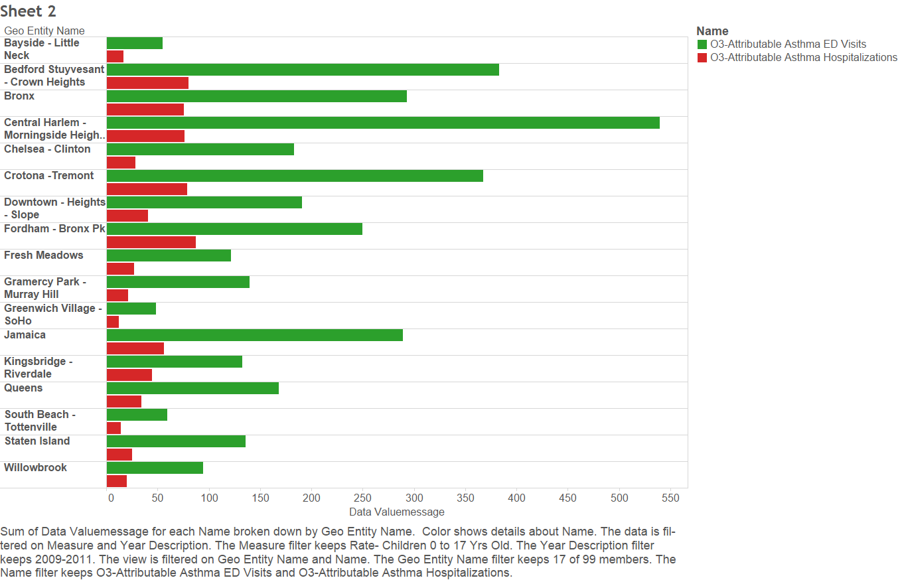
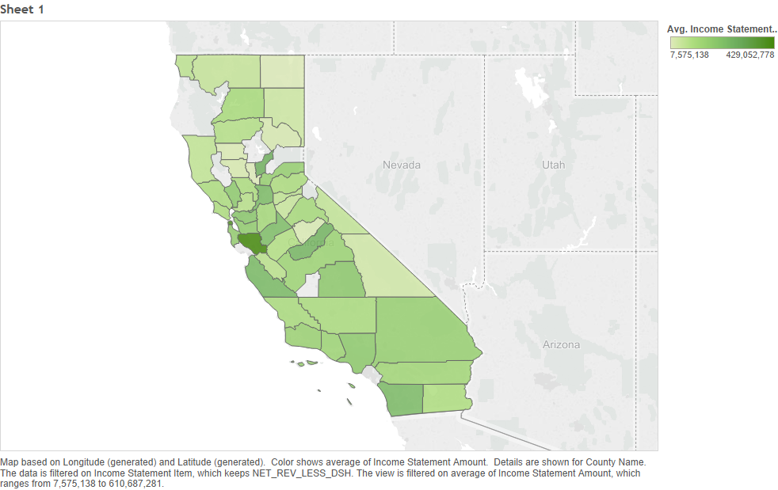
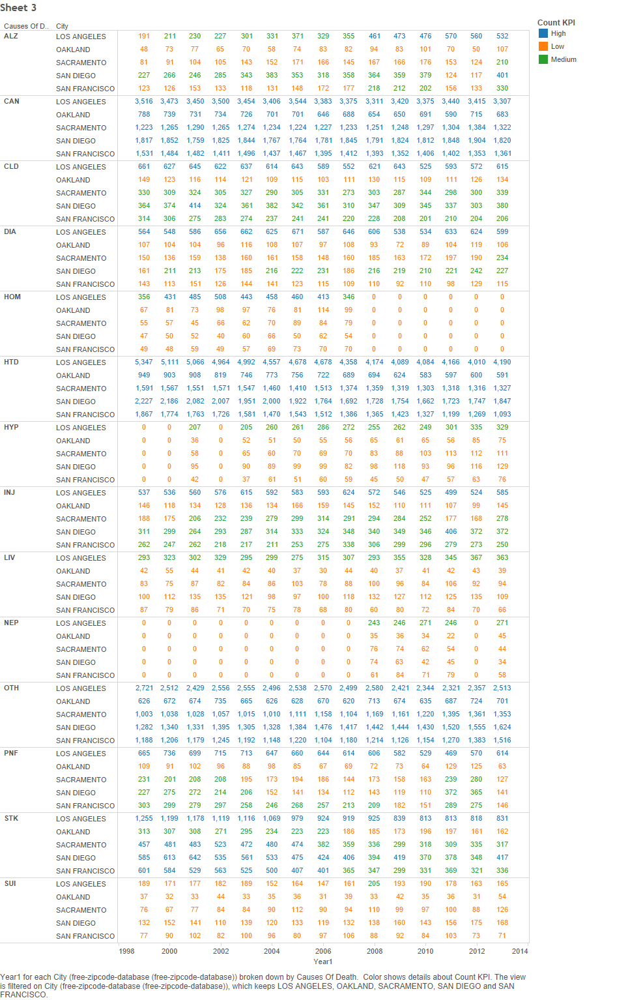
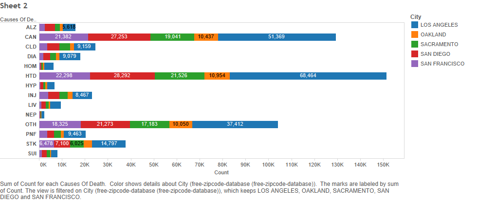

## Pollution, Death, Hospitals...
# The Final Project!

1) We used various data sets from California and New York centering around Health, Healthcare, and Environmentmental measures.

2) We created Extract, Transform, and Load files in R for necessary datas set to prepare the data to be uploaded to the Oracle SQL database to be accessed later in Tableau workbooks and Shiny modules.

```{r}
source("../01 Data/Leading_Cause_Of_Death_ETL.R", echo = TRUE)
```

```{r}
source("../01 Data/Zipcode_file_ETL.R", echo = TRUE)
```

```{r}
source("../01 Data/Hospital_Profitability_ETL.R", echo = TRUE)
```

3) We created a ui.R file and server.R file to launch the Shiny app.

```{r}
source("../04 Shiny/ui.R", echo = TRUE)
```

```{r}
source("../04 Shiny/server.R", echo = TRUE)
```

4) We used Tableau to create the following graphs and data visualizations on our topics.

  

  

  

---
output: html_document 
---
Air Quality & Significance
===
**Every day, chemicals are being released into the air. At times, these are beneficial to our environment, but other times, they can be harmful. We explore the importance of maintaining a good Nitrogen Dioxide emission amount, because too much can affect the ozone levels and in turn affect the health of society.
Additionally, we explored several states and how the air quality has changed over the years.**

 
It's very interesting to compare the air quality over time amongst these selected states. From 2003 to 2014, each state's air quality has improved. However, there are a few states that received better air quality in 2009 than they had in 2014. Still, overall, it's a nice thing to note that the air quality in these states has only gotten better since a decade ago.


In this graph, the darker boxes indicate the neighborhoods of New York City which are exposed to higher concentrations of Nitrogen Dioxide.
It's interesting to note how different the Nitrogen Dioxide Levels are throughout the city of New York. Nitrogen Dioxide has potential to be very harmful when its concentration is too high. NO2 is emitted through road traffic as well as other fossil fuels, and takes a part in forming pollutants like O3.
NO2 is hazardous as it can decrease lung function, lead to illnesses such as bronchitis, and most importantly, it can trigger asthma attacks amongst people with asthma and even children with or without it. Additionally, it has been shown that NO2 exposure enhances allergens' effects.
<br></br>

 
As noted above, NO2 helps form O3, which increasingly adds to poor air quality. In this graph, the red bars indicate ED visits and the green bars indicate Hospitalizations--both of which are due to O3 induced asthma related incidents.
We found an interesting correlation between the neighborhoods with higher concentrations of NO2 and these hospital visits. It seems as though Central Harlem was of the highest O3 induced asthma hospitalization, and in the higher range of ED visits. Additionally, Central Harlem was in the top of the NO2 concentration graph.
A similar match up between the two graphs is seen from Bayside, which had the lowest O3 induced asthma hospitalizations and ED visits. In the NO2 graph, Bayside was amongst the lowest amounts of NO2 concentrations
<br></br>




  

  

5) We deployed the finished shiny app(s) onto the shinyapp.io server after recreating or drawing inspiration from some of the more interesting Tableau graphs and outputs:

URL: https://addison.shinyapps.io/Health